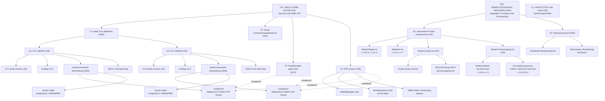

# Schiffstechnik-Diagramm

```mermaid
flowchart TB
  TE1["TE1: WELLE OHNE SCHUB (OR)<br/>Top-Event der MSK-FTA"]
  TE2["TE2: WINKELSTEUERUNG VERLOREN (AND)<br/>Degradiert: Fixwinkel, kein Schubverlust"]

  T1["T1: beide GTs stillstehen (AND)"]
  T2["T2: Haupt-Untersetzungsgetriebe tot<br/>Z3/Z4"]
  T3["T3: Propellerwelle gebrochen<br/>Z6-Z3"]
  T4["T4: CPP verloren (OR)"]

  TE1 --> T1
  TE1 --> T2
  TE1 --> T3
  TE1 --> T4

  T4 --> T4a["Nabe/Blattlager total"]
  T4 --> T4b["Winkelkammern total<br/>(4-6 je Blatt)"]
  T4 --> T4c["Welle-Naben-Verbindung geloest"]

  T1 --> G1["G1: GT1 stillsteht (OR)"]
  T1 --> G2["G2: GT2 stillsteht (OR)"]
  
  G1 --> G1a["GT1 direkt verloren (Z3)"]
  G1 --> G1b["Foelkap GT1"]
  G1 --> G1c["Ueberschussdreh-Abschaltung (AND)"]
  
  G1c --> G1c1["Lastabwurf:<br/>Wellenbruch ODER CPP-Verlust"]
  G1c --> G1c2["Schutz intakt<br/>(magnetisch, HARDWIRE)"]
  G1 --> G1d["FADC1 Fail-Safe-Stop"]

  G2 --> G2a["GT2 direkt verloren (Z3)"]
  G2 --> G2b["Foelkap GT2"]
  G2 --> G2c["Ueberschussdreh-Abschaltung (AND)"]
  
  G2c --> G2c1["Lastabwurf:<br/>Wellenbruch ODER CPP-Verlust"]
  G2c --> G2c2["Schutz intakt<br/>(magnetisch, HARDWIRE)"]
  G2 --> G2d["FADC2 Fail-Safe-Stop"]

  T3 -.->|Lastabwurf| G1c1
  T3 -.->|Lastabwurf| G2c1
  T4 -.->|Lastabwurf| G1c1
  T4 -.->|Lastabwurf| G2c1

  E1["E1: automatische Kette unterbrochen (OR)"]
  E2["E2: Notsteuerung tot (AND)"]
  
  TE2 --> E1
  TE2 --> E2

  E1 --> E1a["Winkel-Regler tot<br/>x~115 m, z~11 m"]
  E1 --> E1b["Stellventil tot<br/>x~14 m, z~7"]
  E1 --> E1c["Winkel-Pumpe tot (OR)"]
  
  E1c --> E1c1["Pumpe direkt verloren"]
  E1c --> E1c2["BUS-Sicherung 400 A<br/>durch/ausgeloescht"]
  
  E1 --> E1d["Winkel-Oelversorgung tot (OR)"]
  
  E1d --> E1d1["Winkel-Oeltank durchbrochen<br/>x~14 m, z~5"]
  E1d --> E1d2["Druckleitung gerissen<br/>kritisch: Sternrohr-Abschnitt<br/>x 14-10.5 m"]

  E2 --> E2a["Handhebel (Ruderstand) tot"]
  E2 --> E2b["Akkumulator (Notstellung)<br/>leer/durch"]

  C1["C1: KRAFTSTOFF tote Kette (OR)<br/>Tank/Pumpen/Filter"]
```